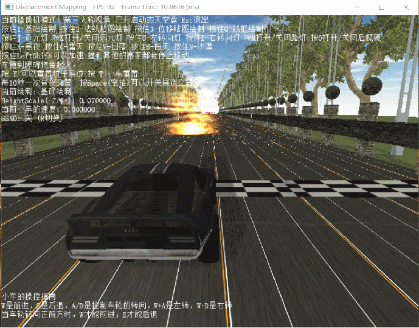
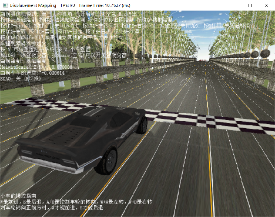
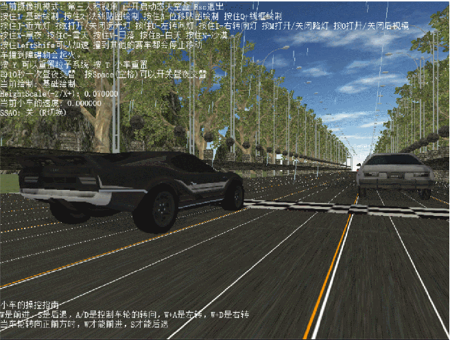
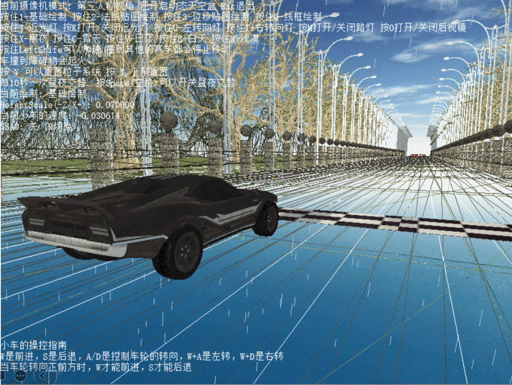

# 使用DirectX11从零开始构建的赛车模拟渲染器

## 作品的简介

#### 	**基于DirectX11制作的赛车模拟渲染器是个人学习渲染技术开发的一个渲染引擎，重点在于通过这个渲染引擎学习前沿的渲染技术。**

## 简单设计思路

#### 1.初步构想

- 用DX11搭建渲染一个场景，场景内有多辆小车和多条车道，可以通过键盘控制小车移动,并实现各种功能
- 在第一阶段完成整个基础的渲染框架的构建，并对DirectX11项目进行初始化
- 在第二个阶段完成对基础功能的实现
- 在第三阶段完成项目各个高级功能

#### 2.初步目标

- 对DirectX11项目进行初始化
- 完成整个基础的渲染框架的构建

#### 3.进一步目标

- 顶点/像素着色器的创建、顶点缓冲区
- 建立索引缓冲区、常量缓冲区
- 添加光照与常用几何模型、光栅化状态
- 使用Direct2D与Direct3D互操作性以及利用DWrite显示文字
- 立方体映射：静态天空盒的读取与实现
- 基础贴图的绘制

#### 4.最终实现

- 几何着色器和域着色器的创建
- 使用DirectXCollision库进行碰撞检测
- 实时阴影映射
- 读取并加载OBJ模型
- 法线贴图
- 通过创建计算着色器和computer Buffer，并实现粒子系统（火焰和雨滴）

## 部分作品的亮点

#### 1.创建计算着色器和computer Buffer，并实现粒子系统的搭建，实现雨点和火焰的效果 

#### 2.基础、法线贴图的绘制 

#### 3.实时阴影映射

#### 4.通过几何着色器实现模型线框的绘制和曲面细分

#### 5.实现昼夜交替、天空盒绘制等效果 

#### 6.导入obj模型 

#### 7.赛车的真实模拟和多赛车的逻辑交互设计

