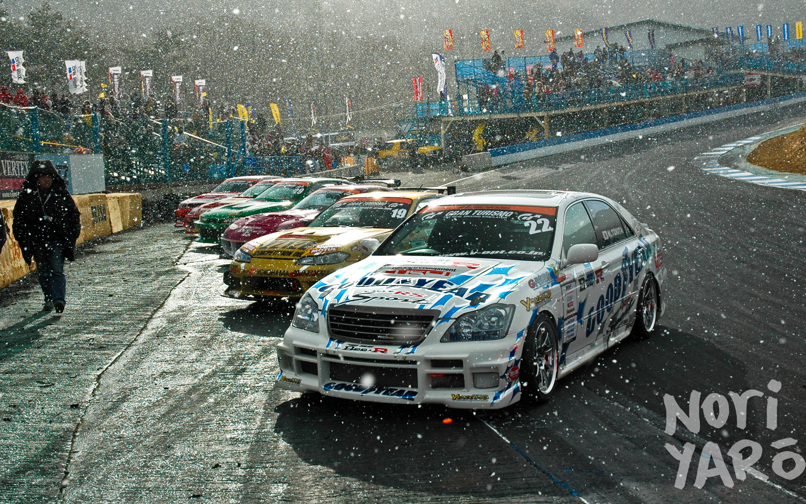
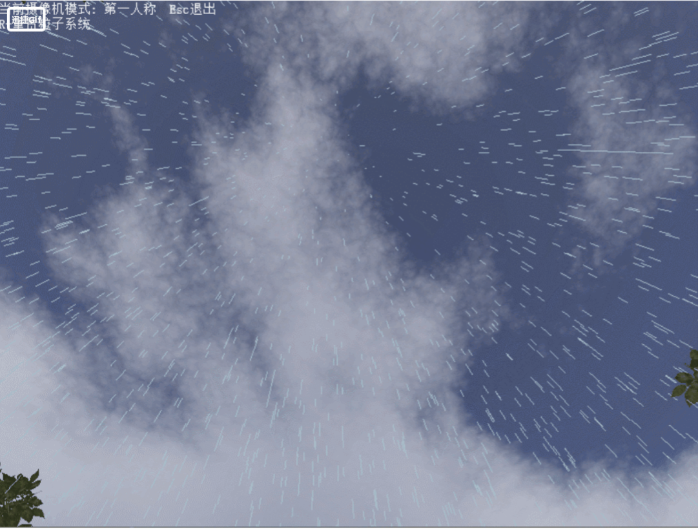
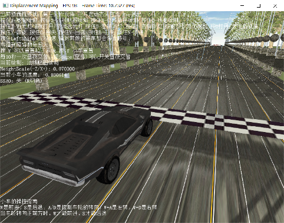
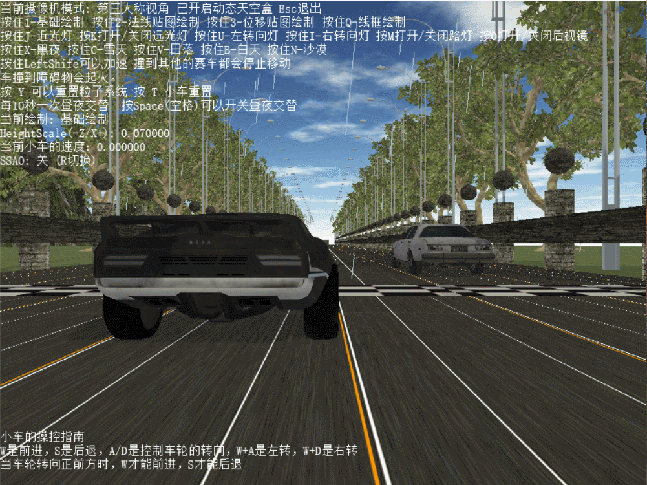
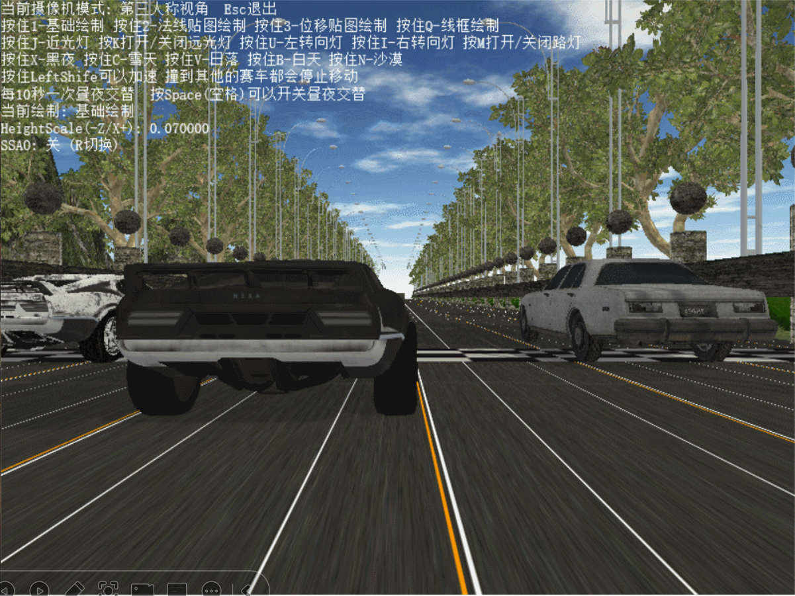
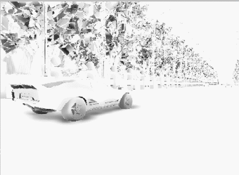
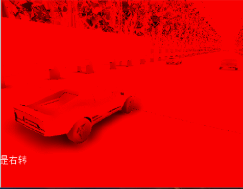

# 使用DirectX11从零开始构建的赛车模拟渲染器

## 作品的简介

#### 	**基于DirectX11制作的赛车模拟渲染器是个人学习渲染技术开发的一个渲染引擎，重点在于通过这个渲染引擎学习前沿的渲染技术。**

- 用DX11搭建渲染一个场景，场景内有多辆小车和多条车道，可以通过键盘控制小车移动,并实现各种功能
- 通过虚拟的小车模拟，来真实的还原现实中的各种场景

## 简单设计思路

#### 1.初步构想

- 搭建渲染一个场景
- 制作多辆小车

#### 2.初步目标

- 完成基础的渲染框架
- 渲染场景
- 完成小车的controller

#### 3.进一步目标

- 实现多项技术方案
- 实现多个小车交互功能

#### 4.最终实现

- 简化多个模块之间的联系
- 代码和算法优化

## 作品的亮点

#### 1.粒子系统的搭建(雨点、火焰) 

#### 2.基础、法线、位移贴图的绘制 

#### 3.实时阴影映射

#### 4.模型线框的绘制

#### 5.实现昼夜交替、天空盒绘制等效果 

#### 6.导入obj模型 

#### 7.赛车的真实模拟和多赛车的逻辑交互设计

#### 8.调试SSAO图和灰度/单通道色显示

